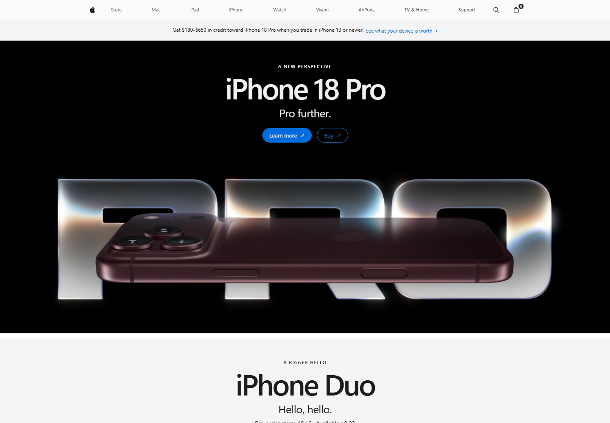
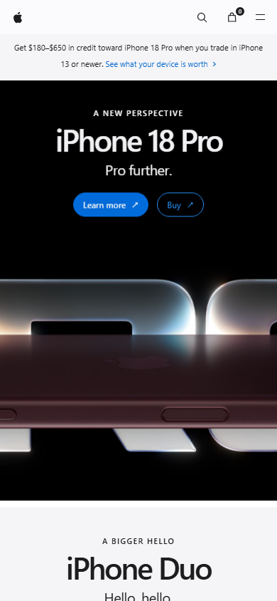

# Apple Homepage Clone

A responsive, single-page recreation of Apple's storefront homepage, built with plain HTML, CSS, and JavaScript.

## Preview

### Desktop



### Mobile



## Run locally

From this directory, start a local server:

```sh
python -m http.server 8000
```

Then open <http://localhost:8000>.

## Included

- Responsive global navigation with search and shopping bag panels
- Product campaign heroes and a six-tile product grid
- Add-to-bag feedback and an interactive entertainment carousel
- Reduced-motion support and keyboard-accessible controls
- Locally stored Apple product images in `assets/`

Product photography in `assets/` is sourced from Apple's public homepage.
